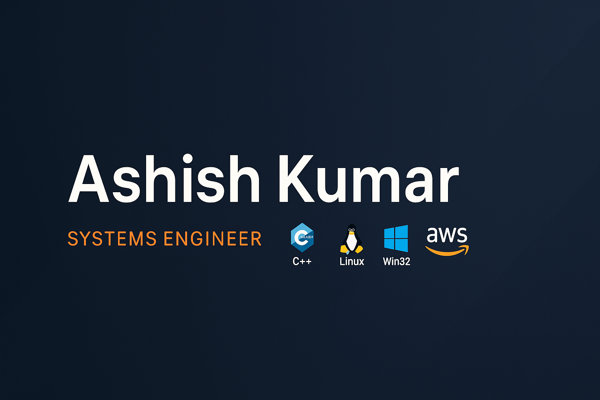

  

<h3 align="center">C++11/14/17 • Linux • Win32 • Python • AWS • AI/ML • Devops • Java</h3>

---

### 🛠️ Tech Stack & Tools  

  

---

### 📊 GitHub Stats  

  <!-- Total Stats -->
  

  <!-- Fixed Streak Stats (Demolab host - replaces old Heroku link) -->
  

  <!-- Top Languages -->
  

---

### 👨‍💻 About Me  
Hey there! I'm Ashish — a systems engineer who loves crafting **high-performance C++ systems** on Linux and Win32 Platform.  
I’m passionate about building **large-scale backend architectures**, optimizing performance, and diving deep into **real-time systems and infrastructure**.  

I enjoy working on **low-latency design, distributed systems**, and exploring the **intersection of C++ and modern cloud platforms like AWS**.  
Always eager to learn, collaborate, and share — whether it’s solving tough bugs or mentoring beginners 👨‍🏫  

---

### 🌐 Connect With Me  

  

---

### 🚀 Let's Connect  
💼 Open to job offers  
🤝 I mentor beginners in C++ and system design  
⚙️ Always up for discussing code, architecture, or performance tuning  

---

### ✨ Fun Zone  
💡 “Talk is cheap, show me the code.” — Linus Torvalds  
☕ Coffee + C++ = happiness  
🐧 Proud Linux user  

---

  <i>Thanks for stopping by — feel free to connect!</i> 
  

